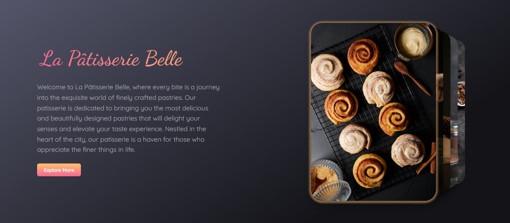

# Stacked Cards with Autoplay
# Стопка карт с автоматическим воспроизведением

## JS is a card flipping function that runs at a specified interval.
##  JS-функция перелистывания карточек, которая запускается по заданному интервалу.

